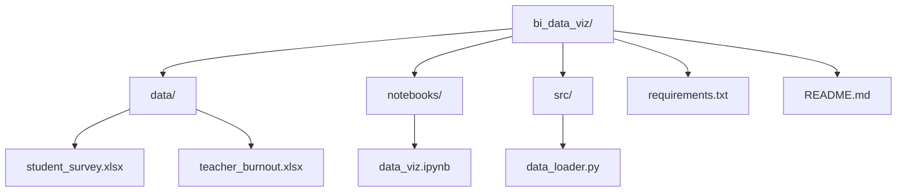

# BI Data Visualization Project: Pandemic Impact on Education

## Overview
Minimal project structure for business intelligence and data visualization using the two XLSX datasets:
- [`Pandemic on Life of Higher Education Students Global Survey.xlsx`](data/student_survey.xlsx): Global student survey on pandemic effects (questions Q1-Q38, countries like Afghanistan, Argentina).
- [`teachers_burnout_pandemia_brazil_translate.xlsx`](data/teacher_burnout.xlsx): Brazilian teachers' burnout data (demographics, digital competence [CD], working conditions [CT], quality of life [QV], Maslach Burnout Inventory [MBI]).

Goal: Jupyter notebook for EDA, cleaning, merging (if relevant), visualizations 

## File Structure
```
bi_data_viz/
├── data/                 # Raw datasets (copy XLSX here)
│   ├── student_survey.xlsx
│   └── teacher_burnout.xlsx
├── notebooks/            # Analysis notebooks
│   └── data_viz.ipynb   # Main BI notebook: load, clean, viz (pandas, plotly/seaborn/matplotlib)
├── src/                 # Reusable Python utilities
│   └── data_loader.py   # Functions: pd.read_excel, basic cleaning (handle missing, encode categoricals)
├── requirements.txt     # Dependencies: pandas, openpyxl, jupyter, plotly, seaborn, matplotlib
└── README.md           
```

## Mermaid Folder Diagram


## Next Steps (Todo)
1. Copy XLSX to `data/` (rename for clarity).
2. Create `requirements.txt`.
3. Implement `src/data_loader.py`.
4. Skeleton `notebooks/data_viz.ipynb`: Import data_loader, load sheets, EDA (df.info(), describe()), viz (histograms for ages/scores, bar charts by country/gender, correlation heatmaps for MBI/CD/CT/QV).
5. Run `pip install -r requirements.txt`, `jupyter notebook`.

## Visualization Ideas
- Student survey: Likert distributions (Q1-Q38), impacts by country/gender.
- Teacher burnout: Boxplots MBI vs age/sex, scatter CD vs CT, heatmaps correlations.
- Compare: Global student stress vs Brazil teacher burnout.

Approve this structure? Changes?