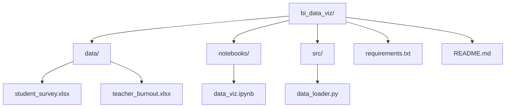

# BI Data Visualization Project: Pandemic Impact on Education

## Overview
Minimal project structure for business intelligence and data visualization using the two XLSX datasets:
- [`Pandemic on Life of Higher Education Students Global Survey.xlsx`](data/student_survey.xlsx): Global student survey on pandemic effects (questions Q1-Q38, countries like Afghanistan, Argentina).
- [`teachers_burnout_pandemia_brazil_translate.xlsx`](data/teacher_burnout.xlsx): Brazilian teachers' burnout data (demographics, digital competence [CD], working conditions [CT], quality of life [QV], Maslach Burnout Inventory [MBI]).

Goal: Jupyter notebook for EDA, cleaning, visualizations 

## File Structure
```
bi_data_viz/
├── data/                 # Raw datasets (copy XLSX here)
│   ├── student_survey.xlsx
│   └── teacher_burnout.xlsx
├── notebooks/            # Analysis notebooks
│   └── data_viz.ipynb   # Main BI notebook: load, clean, viz (pandas, plotly/seaborn/matplotlib)
├── src/                 # Reusable Python utilities
│   └── data_loader.py   # Functions: pd.read_excel, basic cleaning (handle missing, encode categoricals)
├── requirements.txt     # Dependencies: pandas, openpyxl, jupyter, plotly, seaborn, matplotlib
└── README.md           
```

## Mermaid Folder Diagram


## Currently Done: 
1. Initialize
2. Data Preparation

## Next Steps (Todo)
1. Create the Visualizations
2. Insights and Conclusions
3. Sleep

## References
1. https://data.mendeley.com/datasets/88y3nffs82/5 - Pandemic on Life of Higher Education Students Global Survey.xlsx
2. https://zenodo.org/records/7472241 - teachers_burnout_pandemia_brazil_translate.xlsx


